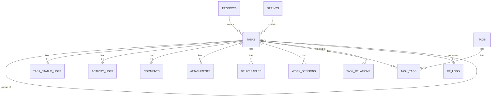

# Atlas — Architecture Document

**Companion to:** `01-product.md`
**Covers:** Tech stack, system design, domain model, database schema, folder structure, auth, deployment.

---

## 1. Tech Stack

| Layer | Choice | Why |
|---|---|---|
| Framework | **Next.js (App Router, TypeScript)** | Full-stack in one codebase — pages, server logic, and API all live together |
| UI | **Tailwind CSS + shadcn/ui**, reskinned with an 8-bit/pixel theme | Fast to build with, fully restyleable, no fighting a heavy design system |
| Database | **PostgreSQL (Neon)** | Relational fit for tasks, relations, history, and tags; Neon's database branching pairs naturally with Vercel preview deployments — a schema change can be tested on a branched DB before merging, no extra tooling needed |
| ORM | **Prisma** | Type-safe schema, migrations, and great DX for a solo dev evolving the schema over time |
| Auth | **Auth.js (NextAuth)**, single allow-listed account | Simple, secure enough for exactly one real user, no password management to build yourself |
| File storage | **Vercel Blob** (or UploadThing) | For attachments/file uploads, only needed once file upload (not just links) is required |
| Hosting | **Vercel** | Zero-config deploys, previews, and it pairs natively with Next.js |

**Deliberately avoided:** Redis, message queues, microservices, GraphQL, or any infrastructure that adds ops overhead without adding value for a single-user app. If a caching layer is ever needed, Next.js's built-in caching/revalidation covers it for now.

---

## 2. High-Level System Architecture

```
Browser (Pixel UI — React Server + Client Components)
        │
        ▼
Next.js App Router
   ├── Server Components (data fetching, rendering)
   └── Server Actions (mutations: create task, change status, etc.)
        │
        ▼
   Prisma Client
        │
        ▼
   PostgreSQL (Neon / Supabase)

        (parallel path for file uploads)
   Browser → Vercel Blob → URL stored on Attachment/Deliverable row
```

**Why Server Actions over a separate REST/API layer:** with a single consumer (you, in the browser), a dedicated API adds indirection without adding value. Server Actions keep mutations colocated with the UI that triggers them. If a public API is ever wanted (it's a non-goal for v1 per `01-product.md`), it can be added later as thin route handlers wrapping the same underlying service functions.

---

## 3. Domain Model (ERD)



Everything still hangs off **Task** as the central entity, exactly as planned in `01-product.md` §8 — Notes and Knowledge Base (future ideas) will attach the same way when they're built, without reshaping this core.

---

## 4. Database Schema

Notes on conventions used throughout:
- All tables use `id UUID` primary keys, `created_at` / `updated_at` timestamps.
- Soft-delete via `deleted_at` (nullable) rather than hard deletes, per the "Archive instead of delete" principle.
- Enums are implemented as Postgres enums via Prisma `enum`.

### 4.1 `users`
Needed because the app is deployed publicly, even though there's exactly one real account.

| Column | Type | Notes |
|---|---|---|
| id | uuid, PK | |
| email | text, unique | the one allow-listed address |
| name | text | |
| created_at | timestamp | |

### 4.2 `projects`

| Column | Type | Notes |
|---|---|---|
| id | uuid, PK | |
| name | text | |
| category | enum: `full_time, university, freelance, side_project, personal` | |
| color | text, nullable | for UI |
| icon | text, nullable | pixel icon key |
| archived_at | timestamp, nullable | |
| created_at / updated_at | timestamp | |

### 4.3 `sprints`

| Column | Type | Notes |
|---|---|---|
| id | uuid, PK | |
| name | text | freetext-or-select, per product doc |
| start_date | date, nullable | |
| end_date | date, nullable | |
| status | enum: `planned, active, completed` | |

### 4.4 `tasks` (the core table)

| Column | Type | Notes |
|---|---|---|
| id | uuid, PK | |
| title | text, not null | only required field on creation |
| description | text, nullable | markdown |
| project_id | uuid, FK → projects.id, nullable | |
| sprint_id | uuid, FK → sprints.id, nullable | |
| parent_id | uuid, FK → tasks.id, nullable | **single parent only** — decision from `01-product.md` §8.10 |
| status | enum: `inbox, todo, ready, in_progress, blocked, waiting_external, testing, done, archived` | |
| type | enum: `coding, investigation, study, analysis, documentation, bug, deployment, testing, meeting, research, design, maintenance, refactor, incident, communication` | |
| priority | enum: `p0, p1, p2, p3, p4` | |
| effort | enum: `xs, s, m, l, xl, xxl`, nullable | |
| story_point | int, nullable | 1 SP ≈ 1 hour |
| reporter | enum: `self, qa, manager, pm, client, lecturer, friend, other` | **defaults to `self`**, per `01-product.md` §8.8 |
| owner_id | uuid, FK → users.id, nullable | defaults to the sole user |
| start_date | date, nullable | |
| due_date | date, nullable | |
| completed_at | timestamp, nullable | set when status → done |
| archived_at | timestamp, nullable | soft archive |
| deleted_at | timestamp, nullable | soft delete |
| created_at / updated_at | timestamp | |

Indexes: `status`, `project_id`, `due_date`, `parent_id` — these back the Kanban/List/Calendar views and the "due/overdue/blocked" dashboard counts.

### 4.5 `tags` / `task_tags`

| `tags` | Type |
|---|---|
| id | uuid, PK |
| name | text, unique |

| `task_tags` | Type |
|---|---|
| task_id | uuid, FK → tasks.id |
| tag_id | uuid, FK → tags.id |

Composite PK `(task_id, tag_id)`. Select-with-freetext in the UI simply creates a new `tags` row on the fly.

### 4.6 `attachments`

| Column | Type | Notes |
|---|---|---|
| id | uuid, PK | |
| task_id | uuid, FK → tasks.id | |
| type | enum: `github_pr, github_issue, confluence, figma, slack, discord, google_docs, google_drive, meeting_recording, website, file_upload, other` | |
| url | text | |
| label | text, nullable | |
| created_at | timestamp | |

### 4.7 `deliverables`

| Column | Type | Notes |
|---|---|---|
| id | uuid, PK | |
| task_id | uuid, FK → tasks.id | |
| type | enum: `pr, confluence, presentation, meeting_notes, design, video, pdf, research` | |
| url_or_content | text | link or free text |
| created_at | timestamp | |

A task can have **zero** rows here — Deliverables are always optional, per `01-product.md` §8.7.

### 4.8 `task_relations`

| Column | Type | Notes |
|---|---|---|
| id | uuid, PK | |
| task_id | uuid, FK → tasks.id | the "from" task |
| related_task_id | uuid, FK → tasks.id | the "to" task |
| relation_type | enum: `blocks, related, duplicate, caused_by, generated_from` | |
| created_at | timestamp | |

`Parent`/`Child` are **not** modeled here — they live on `tasks.parent_id` directly, since a task has at most one parent. `Blocked By` is not a separate stored value either; it's just the inverse view of a `blocks` row (query `related_task_id = this task AND relation_type = 'blocks'`). This keeps the relation table small and avoids storing redundant inverse rows.

### 4.9 `task_status_logs`

| Column | Type | Notes |
|---|---|---|
| id | uuid, PK | |
| task_id | uuid, FK → tasks.id | |
| from_status | enum (nullable for first entry) | |
| to_status | enum | |
| changed_at | timestamp | |

### 4.10 `activity_logs` (everything else that changes)

| Column | Type | Notes |
|---|---|---|
| id | uuid, PK | |
| task_id | uuid, FK → tasks.id | |
| field_name | text | e.g. `priority`, `description`, `tag` |
| old_value | text, nullable | |
| new_value | text, nullable | |
| changed_at | timestamp | |

### 4.11 `comments`

| Column | Type | Notes |
|---|---|---|
| id | uuid, PK | |
| task_id | uuid, FK → tasks.id | |
| body | text | markdown |
| created_at | timestamp | |

### 4.12 `work_sessions`

| Column | Type | Notes |
|---|---|---|
| id | uuid, PK | |
| task_id | uuid, FK → tasks.id | |
| started_at | timestamp | |
| ended_at | timestamp, nullable | null while a session is active |
| duration_seconds | int, nullable | computed on end |

### 4.13 `xp_logs`

| Column | Type | Notes |
|---|---|---|
| id | uuid, PK | |
| task_id | uuid, FK → tasks.id, nullable | null for non-task XP (e.g. achievement bonus) |
| amount | int | |
| reason | text | e.g. `task_completed`, `achievement_unlocked` |
| created_at | timestamp | |

### 4.14 `achievements`

Single-user, so no join table is needed — unlock state lives directly on the row.

| Column | Type | Notes |
|---|---|---|
| id | uuid, PK | |
| key | text, unique | e.g. `first_task`, `100_tasks` |
| name | text | |
| description | text | |
| icon | text | pixel icon key |
| unlocked_at | timestamp, nullable | null = not yet unlocked |

### 4.15 `settings`

Singleton-style key/value store for app-level preferences (theme variant, sound on/off, etc.).

| Column | Type | Notes |
|---|---|---|
| key | text, PK | |
| value | jsonb | |

---

## 5. Folder Structure

```text
src/
├── app/
│   ├── (dashboard)/
│   │   ├── dashboard/page.tsx
│   │   ├── tasks/
│   │   │   ├── kanban/page.tsx
│   │   │   ├── list/page.tsx
│   │   │   ├── table/page.tsx
│   │   │   ├── calendar/page.tsx
│   │   │   ├── timeline/page.tsx
│   │   │   ├── today/page.tsx
│   │   │   ├── waiting/page.tsx
│   │   │   ├── focus/page.tsx
│   │   │   └── archive/page.tsx
│   │   ├── projects/page.tsx
│   │   ├── sprints/page.tsx
│   │   ├── achievements/page.tsx
│   │   ├── statistics/page.tsx
│   │   └── settings/page.tsx
│   ├── auth/                      # sign-in flow
│   └── api/                       # reserved for future webhooks/integrations
│
├── components/
│   ├── ui/                        # shadcn primitives, pixel-reskinned
│   ├── tasks/                     # task card, task form, relation picker, etc.
│   ├── gamification/              # XP bar, achievement toast, streak campfire
│   └── layout/                    # nav, command palette
│
├── lib/
│   ├── db.ts                      # Prisma client singleton
│   ├── auth.ts                    # Auth.js config
│   ├── actions/                   # Server Actions, one file per domain
│   │   ├── tasks.ts
│   │   ├── projects.ts
│   │   ├── relations.ts
│   │   ├── xp.ts
│   │   └── achievements.ts
│   └── utils/
│
├── prisma/
│   ├── schema.prisma
│   └── migrations/
│
├── styles/
│   └── pixel-theme.css
│
└── types/
```

---

## 6. Authentication & Security

- **Auth.js (NextAuth)** with a single allow-listed email (OAuth provider of your choice, e.g. GitHub) — anyone else attempting to sign in is rejected at the callback level. This avoids building/maintaining password reset flows for an app with one user.
- All routes under `(dashboard)` are gated behind an authenticated session — no public read access.
- Secrets (DB URL, OAuth client secret) live in Vercel environment variables, never in code.
- HTTPS is handled automatically by Vercel.
- Row-level authorization isn't needed (single user owns all rows), but foreign key constraints still enforce referential integrity.

> **Assumption flagged:** I've defaulted to OAuth-restricted-to-one-email over a classic email/password form, since it's meaningfully less code to build and secure. Happy to swap to Supabase Auth with magic links instead if you'd prefer — functionally equivalent for this use case.

---

## 7. Offline Strategy — a scoped-down decision

`01-product.md` lists "Offline Friendly" as a principle, but true offline-first (local database + background sync) is a substantial architecture on its own — it usually means a local-first store like SQLite/IndexedDB with a sync layer, which is a lot of infrastructure for a v1.

**Decision for v1:** optimistic UI updates only (the UI reflects a change instantly, before the server confirms), rather than full offline read/write support. This delivers most of the *felt* speed benefit without the sync-engine complexity. True offline support is a candidate to revisit once the app is in daily use and the gap is actually felt.

---

## 8. Non-Functional Requirements

| Concern | Approach |
|---|---|
| Performance | Server Components for initial loads; optimistic updates for mutations; target perceived latency under ~300ms |
| Error handling | Inline form validation + toast notifications for action failures; failed Server Actions roll back optimistic UI state |
| Logging | Console-based for v1; a hosted logger (e.g. Sentry) is a fine v2 addition, not needed to ship |
| Data export | Minimal JSON export endpoint (all tasks + related data) ships in **v1**, since "data belongs to the user" is a stated Product Rule and the endpoint is cheap to build. Richer exports (per-view CSV, scheduled backups) are a v2 nice-to-have |
| Migrations | Prisma Migrate, committed to the repo alongside schema changes |

---

## 9. Deployment

```
GitHub repo
   │  (push to main)
   ▼
Vercel (build + deploy)
   │
   ├── Next.js app  → Vercel Edge/Serverless
   └── Env vars     → DB URL, OAuth secrets, Blob token

Neon Postgres — provisioned separately, connected via DATABASE_URL. Use Neon's branching feature to spin up a matching DB branch alongside each Vercel preview branch when testing risky schema changes.
```

Preview deployments on branches are free with Vercel and useful even solo — you can try a risky schema change on a preview branch pointed at a preview database before merging.

---

## 10. Decisions Log

**Resolved:**
- ~~Neon vs. Supabase for Postgres?~~ → **Neon** — its database branching feature pairs naturally with Vercel's preview-branch workflow already described in §9, letting a risky schema change be tested on an isolated DB branch before merging.
- ~~Build export now or defer?~~ → **Build a minimal JSON export in v1** (§8) — it's cheap, and "data belongs to the user" is a stated Product Rule, not just a nice-to-have.
